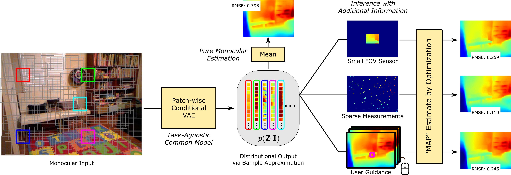

# Generating and Exploiting Probabilistic Monocular Depth Estimates
### [Project Page](https://projects.ayanc.org/prdepth) | [Video](https://youtu.be/lNw9326KSlU) | [Paper](https://openaccess.thecvf.com/content_CVPR_2020/html/Xia_Generating_and_Exploiting_Probabilistic_Monocular_Depth_Estimates_CVPR_2020_paper.html)
Tensorflow implementation of training and utilizing a neural depth sampler for a variety of depth applications.<br>

[Generating and Exploiting Probabilistic Monocular Depth Estimates](https://projects.ayanc.org/prdepth) (CVPR 2020, **Oral Presentation**) <br>
 [Zhihao Xia](https://www.cse.wustl.edu/~zhihao.xia/)<sup>1</sup>,
 [Patrick Sullivan](https://github.com/algoterranean)<sup>2</sup>,
 [Ayan Chakrabarti](https://projects.ayanc.org/)<sup>1</sup> <br>
<sup>1</sup>WUSTL, <sup>2</sup>The Boeing Company



## Setup

Python 3 dependencies:

* tensorflow 1.15
* tensorflow-probability
* matplotlib
* numpy
* imageio

We provide a conda environment setup file including all of the above dependencies. Create the conda environment `prdepth` by running:
```
conda env create -f prdepth/environment.yml
conda activate prdepth
```

## Download pre-trained models
Our pre-trained models, along with the pre-trained feature extractor DORN, which is converted from the [caffe model](https://github.com/hufu6371/DORN) provided by the [DORN paper](https://arxiv.org/pdf/1806.02446.pdf), can be found [here](https://github.com/likesum/prdepth/releases/download/v1.0/trained_models.zip). You can download and unzip them by running
```
bash ./scripts/download_models.sh
```
We provide example input images under `example/inputs/`. To test the pre-trained model on your own data, you need to change the resolution of your images to the NYUv2 resolution and rename input images (RGB, sparse depth, low-resolution depth, etc.) correspondingly. Please see the code and `example/inputs` for details.

## Depth estimation with a single RGB image
Our neural sampler (VAE) is trained with a standard monocular RGB-D dataset, but can be used for a diverse set of applications, including monocular depth estimation and depth estimation with addtional information. When there is no additional information, our model can perform general monocular inference tasks beyond per-pixel depth.

### Monocular depth estimation
In the standard monocular depth estimation application, when only a RGB image is available, run 
```
python test_VAE.py --save_dir example/outputs
```
to get a single depth estimation (mean prediction). To show the diversity of our distributional output, this script will also return the results of ideally selected (best) samples and adversarially selected (worst) samples.

### Pair-wise relative depth estimation
Instead of metric depth estimation, our model can also be used for predicting which of the two points in the scene are closer than the other.
Run
```
python original_estimation.py
```
to get the accuracy of the relative depth estimation using our distributional output, comparing to using the ordering of the individual depth value pairs in a monocular depth map estimate.


## Depth estimation with additional information
We provide the implementation to combine our distributional output (from monocular cue) with a variety of additional partial information about depth to derive a more accurate scene depth estimate, *without retraining*. To get predictions for different applications and different settings in each application, simply change the input as they can all be done with our single model. We provide the hyper-parameters for each application in each script, which are found on our validation dataset.

### Sparse to dense with arbitrary sparse measurements
Consider the task of estimating the depth map when the inputs are a color image and a sparse depth map. Run
```
python sparse_to_dense.py --save_dir example/outputs [--nsparse num_of_sparse_points]
```
and compare the result with our monocular estimate (mean prediction).

### Sparse to dense with confidence-guided sampling
Our distributional outputs can provide spatial map of the relative monocular ambiguity in depth at different locations, which can guide the depth sampling given a fixed budget of measurements. Run
```
python guided_sampling.py --save_dir example/outputs [--nsparse num_of_sparse_points]
```
to get the guided sparse measurements and the dense depth estimation using this sparse depth map. Compare it with the output of sparse to dense with arbitrary sparse measurements.

### Depth upsampling
Consider the task of depth super-resolution from a low-resolution depth map along with a color image. Run
```
python depth_upsample.py --save_dir example/outputs [--factor downsampling_factor]
```

### Depth uncropping
Consider the task of extrapolating the depth measurements from a sensor of small field-of-view (FOV) or along a single line, with a color image of a larger FOV. Run
```
python depth_uncrop.py --save_dir example/outputs [--height height_of_crop] [--width width_of_crop]
```


### Diverse global estimates for user to select
Our model can provide a set of diverse global depth estimates for user to select given a sinle image. We simulate the user selection by selecting the most accurate depth estimation. Run
```
python diverse_estimaion.py --save_dir example/outputs [--n_estimation num_of_diverse_estimations]
```

### Depth estimation with user annotations of erroneous regions
As an extension, we consider also getting annotations of regions (only locations, not depth values) with high error from the user in each estimate. We simulate user annotations by comparing the estimation with ground-truth depth. Run
```
python interactive_estimation.py --save_dir example/outputs [--n_estimation num_of_diverse_estimations]
```
and compare the result with diverse estimation without user annotations.


## Training your own models
Our model is trained on the standard [NYUv2 RGB-D dataset](https://cs.nyu.edu/~silberman/datasets/nyu_depth_v2.html). To train your own model, download the dataset and update `data/NYUtrain.txt` and `data/NYUval.txt` with path to each training and validation image. Then run
```
python train_VAE.py
```
You can press `ctrl-c` at any time to stop the training and save the checkpoints (model weights and optimizer states). The training script will resume from the latest checkpoint (if any) in the model directory and continue training.

Since our VAE uses a pre-trained [DORN](https://github.com/hufu6371/DORN) model as the feature extractor, to train our model on your own dataset, you might need to train a DORN model first.


## Citation
If you find the code useful for your research, we request that you cite the paper. Please contact zhihao.xia@wustl.edu with any questions.
```
@inproceedings{xia2020generating,
  title={Generating and Exploiting Probabilistic Monocular Depth Estimates},
  author={Xia, Zhihao and Sullivan, Patrick and Chakrabarti, Ayan},
  booktitle={Proceedings of the IEEE/CVF Conference on Computer Vision and Pattern Recognition},
  pages={65--74},
  year={2020}
}
```


## Acknowledgments
This work was supported by the National Science Foundation under award no. [IIS-1820693](https://www.nsf.gov/awardsearch/showAward?AWD_ID=1820693). Any opinions, findings, and conclusions or recommendations expressed in this material are those of the authors, and do not necessarily reflect the views of the National Science Foundation.


## License
This code `prdepth/tf_extract_grad.py` is taken from an [older version of Tensorflow]( https://github.com/tensorflow/tensorflow/blob/r1.7/tensorflow/python/ops/array_grad.py#L725). Our TF implementation of DORN is based on the [caffe implementation](https://github.com/hufu6371/DORN) provided by the authors. The rest of the code is licensed under the MIT License.
